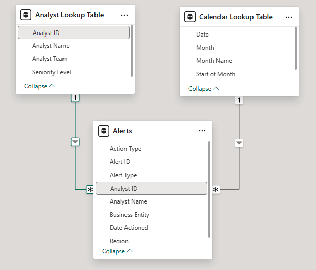
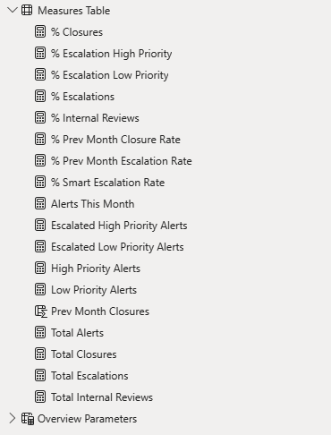
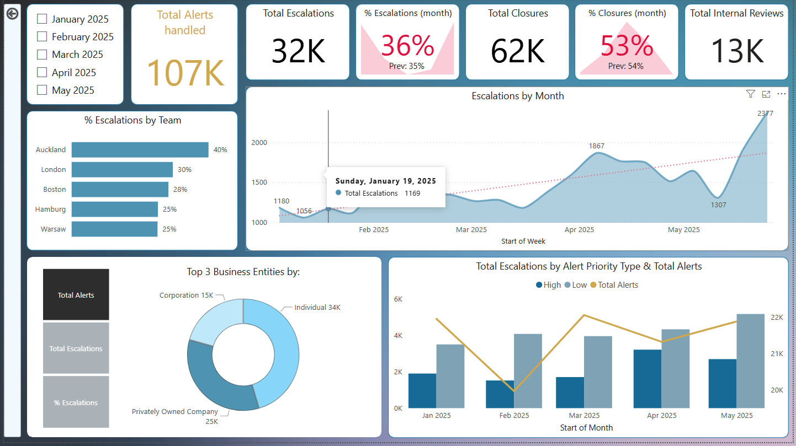
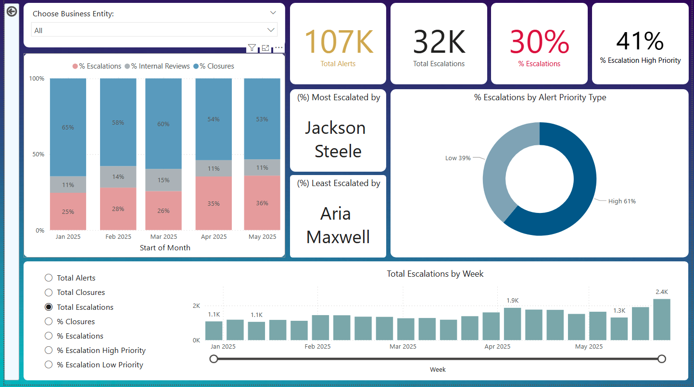
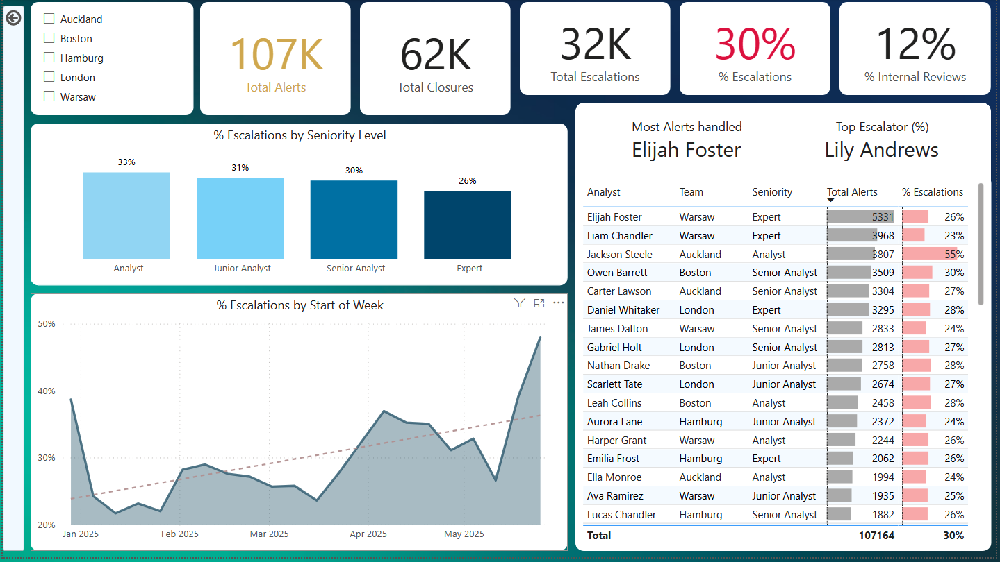

# ALERT ESCALATION RATE

> This is a project I worked on while in my position as a Sanctions Screening analyst - it has been recreated with dummy data.
> 

### PROJECT BACKGROUND AND OVERVIEW

 In the Financial Screening Department, analysts handle alerts on a day-to-day basis, where they need to review a customer’s bank account and transaction activity after it has been flagged by the system and detect any (potentially) suspicious activity. They work on two systems - one for customers in the USA and the other for accounts in the EU. After their investigation, analysts can either “close” the alert or “escalate” for next level review, or mark for further “internal review”. 
 The Next Level Review team advised the Financial Screening Department that they are receiving an ***unusually high number of escalations*** - cases which could easily be handled by the Screening Department. 

 At the request of the department head, the project manager was tasked to identify the reasons behind such high rate and if there are certain analysts/teams or periods with a huge spike in the rate that drive the overall trend upward and/or identify trends across business entities, regions, and alert types. Insights are provided in the following sections:

- **Summary/Overview -** Total alerts, escalation/closure/internal review rates, monthly trends in alert volumes and escalation ratios, escalation breakdown by team and alert type.
- **Analyst Insights -** Analyst-level performance metrics, team-based filtering, comparison across seniority levels.
- **Business Entity -** Escalation trends by business entity, entity-level alert volume, escalation rate, alert-type filters for deeper insights.

Interactive Power BI dashboard file can be downloaded [here.](project.files/escalation_ratio_dashboard.pbix)

Source file (xlsx) can be downloaded [here.](project.files/escalation_ratio_source_file.xlsx)


### DATA STRUCTURE OVERVIEW

This project tracks over 100k rows and analyzes the analysts’ escalation rate over the course of 5 months [Jan 2025 - May 2025]. The dataset structure for the current project consists of 3 tables, Analysts Table, appended US and EU alerts tables, which were pulled from company’s database with SQL and a Calendar Lookup Table as can be seen below in the ERD.




From the Database, the following queries were used to obtain/filter out the relevant data:

```sql
SELECT
    ALERT_IDENTIFIER as Alert_ID,
    EC_REGION_NAME as Region,
    ALERT_TYPE as Alert_Type,
    ACTION_DATE as Date_Actioned,
    COMMENT_PROVIDER_NAME as Analyst_Name,
    COMMENT_PROVIDER_USERID as Analyst_ID,
    STEP_LABEL as Action_Type
FROM 
(
    SELECT * FROM WF.ACTIONED_ALERTS
        WHERE EC_REGION_NAME IN ('US', 'EU')
) as US_EU_COMBINED
        WHERE 
            ACTION_DATE BETWEEN '2025-01-01' AND '2025-05-31'
                AND COMMENT_PROVIDER_USERID IN 
(   
        'AB44191',
        'AB63502','AM91881','AQ88630','AL88900','AR25736','BR58635','CM33989','CL88262','CV18623','DW97142',
        'DR09121','EF59436','EM14316','EF32910','EC39334','GH29253','GW92280','HG69746','HB21225','HM72482',
        'IK47162','IH32280','JS51643','JD15319','JW12092','JP91159','LS50757','LC41765','LC21787','LA28655',
        'LA67926','LC38109','MP49132','MH40444','MB64210','ND30042','ND24877','NB58703','NS27682','OS98495',
        'OB73133','PL51012','SC85599','ST46258','SB82836','SG66728','VN14426','WB90635','ZC47537'
)
ORDER BY ACTION_DATE 
```

```sql
SELECT 
USERID as Analyst_ID,
USERNAME as Analyst_Name,
USER_REG_HUB as Analyst_Team
FROM ACF.USERID_TABLE
WHERE USER_REG_HUB IN ('Warsaw', 'Auckland','London','Boston','Hamburg')
ORDER BY 1
```

Initial exploratory analysis were done in Excel, since the dataset is relatively small. 

The image below shows the Measures Table which stores the explicit measures created to conduct the analysis.



### SUMMARY/OVERVIEW

The findings confirm the initial hypothesis - the escalation rate shows an overall upward trend since January. Notably, April was the month with the highest escalation rate at 35%, a 9% increase from the previous month. The escalation rate seemed to have recovered in the 1st week of May, dropping to 27% before eventually going back up to 36% at the end of May. Especially worthy to note that a whopping 66% of all *high priority* alerts were escalated to the next level review even though the overall alert volume stayed around 5K per week throughout the whole observed period. Auckland, with 40%, is the team with the highest escalation rate among the 5 teams. Additionally, analysts with the highest escalation ratios were identified.

Below is the overview page from the Power BI dashboard and more examples/calculations are included throughout the report. 

Please download the entire interactive dashboard [here.](project.files/escalation_ratio_dashboard.pbix)




### BUSINESS ENTITY PAGE

Overall, escalation rate across all business entities saw an approximate 10% increase over the observed period. High priority escalations make up over 61% of all the escalated alerts, this number reaching 64 % for "Corporation" and "Private Owned Company" business entities. Almost half of screening alerts for “Foreign entity” business entities were escalated to the next level, with escalations going above 50% in February and April. Since the overall volume stayed consistent throughout the observed period, an upward trend in escalation rates across all business entities signals that this is not a proportionate growth due to the volume of total alerts processed.




### ANALYST DETAIL PAGE

As expected, Experts show a lower rate of escalation due to their experience in processing the cases. Warsaw, with the most alerts processed (31K) among other teams, has an escalation rate of 25%, with the rate of the individual team members also hovering around 25%. Auckland, on the other hand, has the highest escalation rate at 40%, and this number was largely inflated due to a small number of team members whose rate reached nearly 60% or above. Interestingly, all the analysts with a rate of 50% or even more are based in Auckland. Hamburg, being the smallest team in the department, processed the least number of alerts overall (13K) and escalated on average a quarter of those alerts.




### FINAL WORDS AND RECOMMENDATIONS

- Escalation rate for the whole department is being heavily driven up by a handful of team members - therefore, focus should be given on organising ongoing training for those and address any areas that were previously unclear and need improvement.
- Implement an escalations tracker to take a sample of escalated alerts every EOD to identify any common patterns/errors and revert back to makers in case of any mismatch in the final decision.
- Organize knowledge sharing sessions at least once a week, where a member of the next level review team shares their findings and any errors detected based on the alerts escalated to them.
