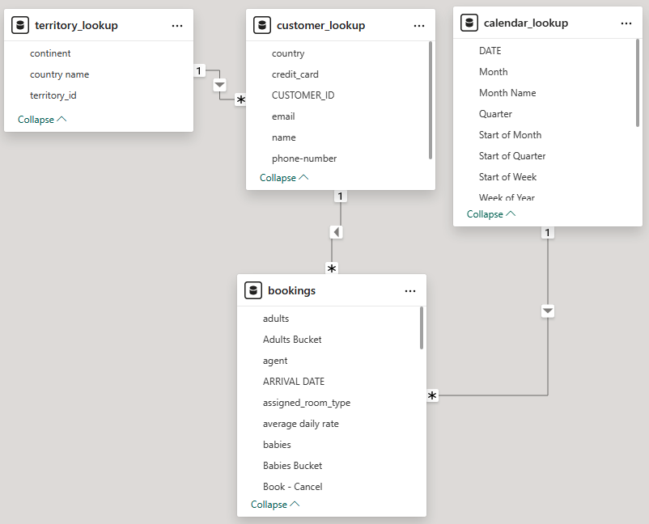
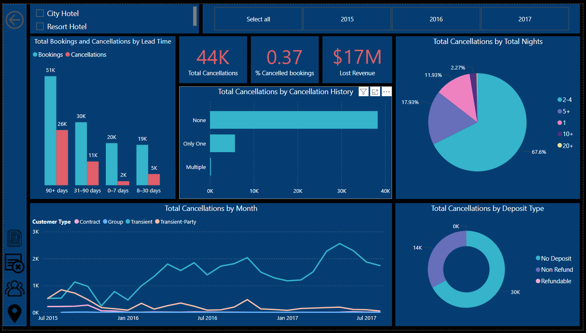
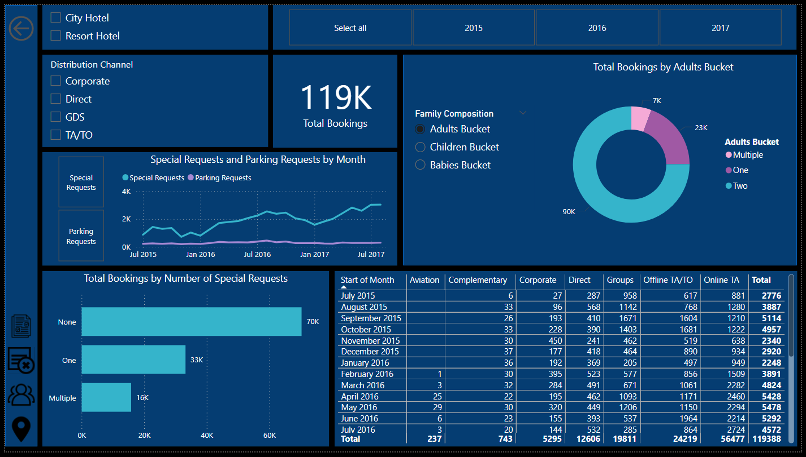

### PROJECT BACKGROUND AND OVERVIEW

Hotel Inc., established in 2011, is the company managing two hotel, City Hotel, located in a bustling downtown and a Resort Hotel, operating in a popular holiday destination. The company has significant amounts of data on its booking rates, distribution channels, customer profile and the revenue generates and lost between 2015 and 2017. This project analyzes and thoroughly synthesizes this data in order to uncover important insights and provides actionable visuals to drive decisions for Directors, Finance, and Marketing teams.

Insights are provided in the following areas:

- 📈**Financial performance** - assessment of earned vs lost revenue of both hotels, using average daily rate and the total nights stayed, across all years observed
- ✖️**Cancellation analysis** - an analysis of cancellation behavior by lead time, deposit type and previous cancellation history
- 🧑‍🤝‍🧑**Customer Profile** - a detailed view of distribution channels, composition of guests and their booking requests.

An interactive dashboard file can be downloaded [here.](https://github.com/KhikmatillaTeshaboev/PORTFOLIO/blob/main/Power_BI/Hotel_Bookings/project.files/Hotel%20Bookings.pbix)

The raw/unedited CSV source file with booking information can be found [here.](https://github.com/KhikmatillaTeshaboev/PORTFOLIO/blob/main/Power_BI/Hotel_Bookings/project.files/csv_hotel_booking.csv)

The transformed Excel source file after error/duplicate checks and cleanup can be downloaded [here.](https://docs.google.com/spreadsheets/d/1_y4MdYag0e9JDRrt_tkDoyIDxTzpQXIU/edit?usp=sharing&ouid=108745035230479932018&rtpof=true&sd=true)

### DATA STRUCTURE OVERVIEW

Data was already retrieved from a database and presented as a CSV file, no SQL queries were used. The dataset contains 119390 rows (bookings). During exploratory analysis, the bookings data were divided into bookings, customer_lookup, calendar_lookup and territory_lookup tables. The process description can be found [here.](https://github.com/KhikmatillaTeshaboev/PORTFOLIO/blob/main/Power_BI/Hotel_Bookings/project.files/Power_BI_tables_description)

The entity relationship diagram (ERD) is presented below:

### EXUCUTIVE SUMMARY

City Hotel and Resort Hotel performed similarly between 2015 and 2017, accruing $ 14M and 12M respectively overall, however, the former losing around $ 11M and latter 6M in unearned revenue. Numbers indicate that City Hotel had nearly 80000 bookings in total, with the number of stays increasing year over year, while Resort Hotel - only half of that. The country with the most bookings was Portugal; Transient customers were by far the biggest guests - accounting for around 70% across two hotels and all 3 years tracked. Additionally, average daily rates (adr) usually peak at week 34 of the year - around the month of August, with number of bookings following a similar trend.

Below is the overview/summary page from Power BI dashboard. The entire interactive dashboard can be downloaded [here.](https://github.com/KhikmatillaTeshaboev/PORTFOLIO/blob/main/Power_BI/Hotel_Bookings/project.files/Hotel%20Bookings.pbix)

### CANCELLATION ANALYSIS

**Average cancellation rate around 30 %** for the duration of the analysis, this number was especially driven upwards due to lead time - 90+ days bucket. Thus, there is a somewhat expected relationship between lead time and cancellation rate. Both the number of cancellations and the % of cancelled bookings increase as the lead time increases - this means the more in advance the booking was made, the higher the chance it could be cancelled. On average, around 51% of all bookings made 90+ days in advance were cancelled, with this number showing a whopping 61% in 2015. 

On the other hand, we see an interesting nexus between the deposit type and the cancellation rate - almost a 100% of all bookings with non-refundable deposit were cancelled.

**Room type mismatch**, when a guest got a room different than what they originally selected, did not influence cancellations in particular, with only between 1 and 3 % of cancellations being due to room type mismatch.

**Cancellations by Total Nights** reveal further details, for City Hotel, during all 3 years, Bookings for between 2 and 4 nights were cancelled the most. For Resort Hotel, on the other hand, 45% of cancelled bookings were for stays of 2-4 days, and around 37% were for longer stays, 5+ days to be more precise.

### CUSTOMER PROFILE

Overall, guests of two accounted for by far the biggest portion of all stays at around 75%. And, on average, 91% of all stays did not include children and 99% of adults did not travel with babies.

Travel Agencies/Travel Offices brought in the most customers - at 82%, again two people bookings making up the majority of stays. Corporate, on the other hand, shows that those work trips are usually made by a single person - 68% of total bookings for Corporate.

Its interesting to note that the number of special requests grew gradually from an average of 1500 requests in 2015 to nearly double that amount in 2017. A little over 30% of all bookings had at least one request, and 13% had multiple requests.

### FINAL THOUGHTS & RECOMMENDATIONS:

- Accounting for almost 42% of all repeat customers, Corporate distribution channel, shows great potential for future investment, while only being around 6 % of total bookings (bringing over $800K in revenue). Providing extra services and offers tailored to corporate clients and competitive rates will grow the client base strengthening hotel’s reputation among corporate clients.
- Portugal has by far the biggest share of customer base for the hotel - run marketing campaigns to reinforce this position. Meanwhile, allocate a higher marketing budget to advertise offers/deals to customers from the **UK** and **France** - the two next biggest customer market.
- **Re-evaluate the cancellation policy** for bookings 90+ days in advance, either charging a fee for cancelling proportionate to the number of days left till the arrival date or offer extra value to keep the booking unchanged
