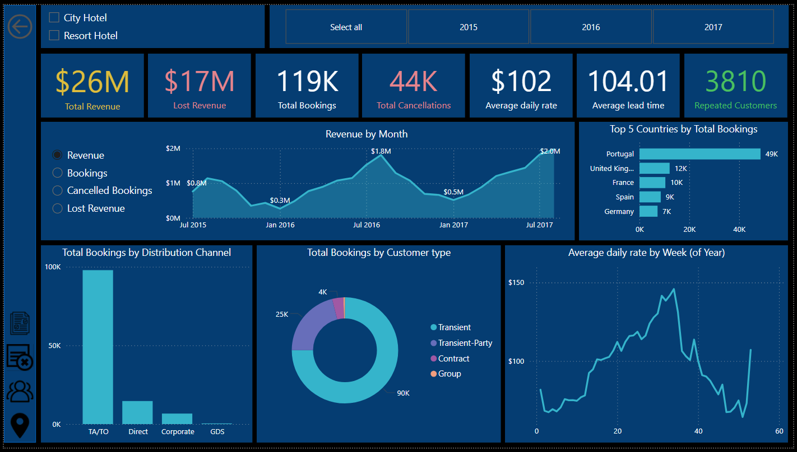

### Preview of Projects

This directory stores dashboards I worked on, where the main end result is a Power BI dashboard (`pbix`). 

It showcases my skills in ETL and EDA with the help of:
- SQL queries
- Excel
- Power Query
- DAX.

  <table>
    <tr>
      <td align="center">
        <strong>Project 1: Escalation Rate Analysis</strong> 
        
      </td>
      <td style="width: 60px;"></td> <!-- Spacer column --><!-- Spacer column -->
      <td align="center">
        <strong>Project 2: Hotel Bookings Analysis</strong> 
        
      </td>
    </tr>
  </table>

